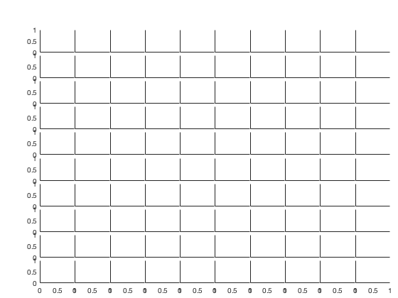
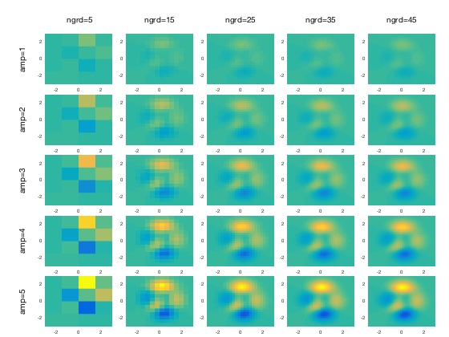
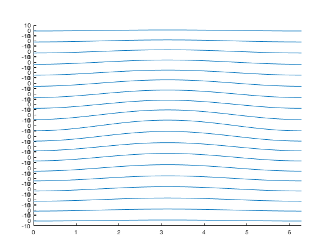
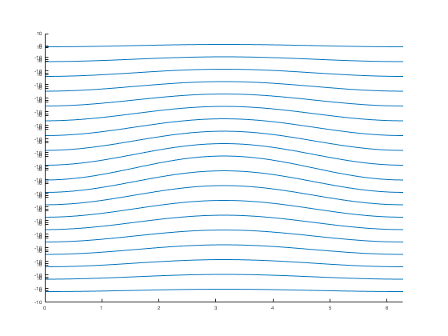
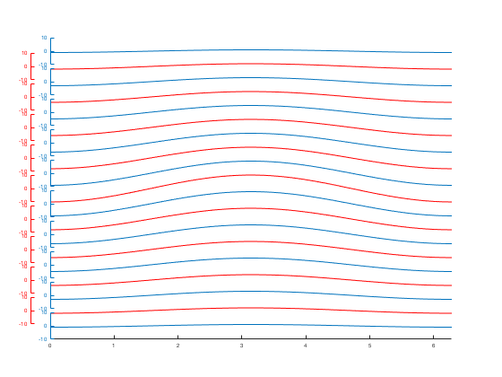
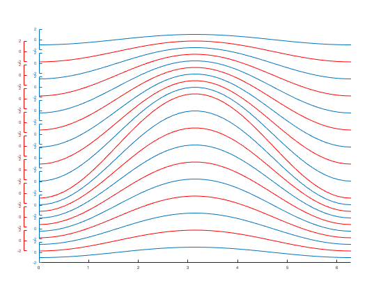

# plotgrid.m: Set up (and plot to) a grid of axes


Author: Kelly Kearney


This repository includes the code for the `plotgrid.m` Matlab function, along with all dependent functions required to run it.


This function sets up a grid of axes, returning handles in arrays with the same geometry as the axes themselves, making it easier to reference plotted objects.  It allows for several customization options, including the margins around and spacing between axes, optional row and column labels, and options to offset axes from each other.


This function also provides a quick method of applying the same plotting function with different data for each axis, via cell array input. See examples below for further details.


## Contents


- Getting started        
- Syntax        
- Description        
- Examples: Simple axis setup        
- Examples: plotting data        
- Examples: Staggered axes        
- Contributions

## Getting started


**Prerequisites**


This function requires Matlab R14 or later.


**Downloading and installation**


This code can be downloaded from [Github](https://github.com/kakearney/plotgrid-pkg/).


**Matlab Search Path**


The following folders need to be added to your Matlab Search path (via `addpath`, `pathtool`, etc.):


```
plotgrid-pkg/plotgrid
plotgrid-pkg/offsetaxis
plotgrid-pkg/subaxis
```


## Syntax


```
h = plotgrid(...)
```


See function header help for a full description of the input parameters and output variable from this function.


## Description


`h = plotgrid('size', [n m])` creates a new figure with `n*m` axes arranged in `n` rows and `m` columns, using the default margin, spacing, and padding set by the `subaxis.m` function.


`h = plotgrid('function', {@plotfun, x1, x2, ...})`  plots the data in cell arrays `x1`, `x2`, etc. to a grid of axes, using the plotting function handle supplied.  The size of the main input cell array should be 1 x nin+1, where nin is the number of inputs required by `plotfun`. Each element of the `x1`, `x2`, etc. cell arrays should match the requirements of the plotting function inputs.  See examples below.


`h = plotgrid(..., 'rowlabel', rows, 'collabel', cols)` adds text labels to the left and/or top of each row and/or column, respectively.  `rows` should be an `n x 1` cell array of strings, and `cols` should be a `m x 1` cell array of strings.


`h = plotgrid(..., 'rowlabel', rows, 'rowlabeloffset', offset)` and/or `h = plotgrid(..., 'collabel', cols, 'collabeloffset', offset)` changes the distance the row and/or column labels are placed from the axes area.


`h = plotgrid(..., 'staggerx', offset)` and/or `h = plotgrid(..., 'staggerx', offset)` adds an offset x/y axis to every other column/row, offset from each axis by the specified offset fraction.  See examples below.


`h = plotgrid(..., 'figprop', {param1, val1, param2, val2, ...})` applies the specified figure properties to the newly-created figure.


`h = plotgrid(..., 'function], {@plotfun, in, ...}, 'outputs', {'out1', 'out2',...})` returns the outputs of the plotting functions as fields in the `h` output structure, with fieldnames set by the specified strings.


## Examples: Simple axis setup


In it's simplest form, this function can be used to set up a grid of axes:


```matlab
h = plotgrid('size', [3 4])
```


```

h = 

struct with fields:

fig: [1&times;1 Figure]
ax: [3&times;4 Axes]


```


The axis handles in the output structure array are arranged in the same geometry as the axes themselves, making it easy to reference handles as a group.  For example, we can turn of tick labels for just the interior axes:


```matlab
set(h.ax(:,2:end), 'yticklabel', '');
set(h.ax(1:end-1,:), 'xticklabel', '');
```


This function uses [subaxis](https://www.mathworks.com/matlabcentral/fileexchange/3696-subaxis-subplot) to create the axes, so you can use its various options to customize the margin around the axes and the spacing between them.  This can be very useful when setting up a grid with lots of small subaxes:


```matlab
h = plotgrid('size', [10 10], 'SpacingVert', 0.01, ...
'SpacingHoriz', 0, 'MarginRight', 0.02, 'MarginBottom', 0.05);
set(h.ax(:,2:end), 'ytick', []);
set(h.ax(1:end-1,:), 'xtick', []);
set(h.ax, 'box', 'off');
```





## Examples: plotting data


We can also use `plotgrid` to plot different datasets using a common plotting function.


```matlab
% Create some variants on the peaks data

ngrd = 5:10:50;
amp = 1:5;
[ngrd, amp] = meshgrid(ngrd, amp);
[xp,yp,zp] = arrayfun(@(n,a) peaks(n), ngrd, amp, 'uni', 0);
zp = cellfun(@(a,b) a*b, zp, num2cell(amp), 'uni', 0);
```


Our data to be plotted consists of 25 different variants of the x, y, and z data:


```matlab
xp
yp
zp
```


```

xp =

5&times;5 cell array

Columns 1 through 4

[5&times;5 double]    [15&times;15 double]    [25&times;25 double]    [35&times;35 double]
[5&times;5 double]    [15&times;15 double]    [25&times;25 double]    [35&times;35 double]
[5&times;5 double]    [15&times;15 double]    [25&times;25 double]    [35&times;35 double]
[5&times;5 double]    [15&times;15 double]    [25&times;25 double]    [35&times;35 double]
[5&times;5 double]    [15&times;15 double]    [25&times;25 double]    [35&times;35 double]

Column 5

[45&times;45 double]
[45&times;45 double]
[45&times;45 double]
[45&times;45 double]
[45&times;45 double]


yp =

5&times;5 cell array

Columns 1 through 4

[5&times;5 double]    [15&times;15 double]    [25&times;25 double]    [35&times;35 double]
[5&times;5 double]    [15&times;15 double]    [25&times;25 double]    [35&times;35 double]
[5&times;5 double]    [15&times;15 double]    [25&times;25 double]    [35&times;35 double]
[5&times;5 double]    [15&times;15 double]    [25&times;25 double]    [35&times;35 double]
[5&times;5 double]    [15&times;15 double]    [25&times;25 double]    [35&times;35 double]

Column 5

[45&times;45 double]
[45&times;45 double]
[45&times;45 double]
[45&times;45 double]
[45&times;45 double]


zp =

5&times;5 cell array

Columns 1 through 4

[5&times;5 double]    [15&times;15 double]    [25&times;25 double]    [35&times;35 double]
[5&times;5 double]    [15&times;15 double]    [25&times;25 double]    [35&times;35 double]
[5&times;5 double]    [15&times;15 double]    [25&times;25 double]    [35&times;35 double]
[5&times;5 double]    [15&times;15 double]    [25&times;25 double]    [35&times;35 double]
[5&times;5 double]    [15&times;15 double]    [25&times;25 double]    [35&times;35 double]

Column 5

[45&times;45 double]
[45&times;45 double]
[45&times;45 double]
[45&times;45 double]
[45&times;45 double]


```


Plotting now mimics the arrangement of elements in `xp`, `yp`, and `zp`, applying the same function to each element of the cell array:


```matlab
h = plotgrid('function', {@(x,y,z) pcolor(x,y,z), xp, yp, zp}, ...
'sp', 0.03, ...
'mb', 0.03, ...
'mr', 0.03, ...
'rowlabel', cellstr(num2str(amp(:,1), 'amp=%d')), ...
'collabel', cellstr(num2str(ngrd(1,:)', 'ngrd=%d')), ...
'rowlabeloffset', 0.06, ...
'outputs', {'pcol'});

% Some cosmetic adjustments to the axes

set(h.ax, 'xlim', [-3 3], 'ylim', [-3 3], 'clim', [-40 40], ...
'fontsize', 6);
arrayfun(@(ax) shading(ax, 'flat'), h.ax);
```




The above also demonstrates how to return the handles of plotted objects via the `'outputs'` parameter.  The `pcol` field in the output structure now holds the handles to the surface objects created by `pcolor`:


```matlab
h.pcol
```


```

ans =

5&times;5 cell array

Columns 1 through 4

[1&times;1 Surface]    [1&times;1 Surface]    [1&times;1 Surface]    [1&times;1 Surface]
[1&times;1 Surface]    [1&times;1 Surface]    [1&times;1 Surface]    [1&times;1 Surface]
[1&times;1 Surface]    [1&times;1 Surface]    [1&times;1 Surface]    [1&times;1 Surface]
[1&times;1 Surface]    [1&times;1 Surface]    [1&times;1 Surface]    [1&times;1 Surface]
[1&times;1 Surface]    [1&times;1 Surface]    [1&times;1 Surface]    [1&times;1 Surface]

Column 5

[1&times;1 Surface]
[1&times;1 Surface]
[1&times;1 Surface]
[1&times;1 Surface]
[1&times;1 Surface]


```


To allow for any-sized outputs from the plotting function, the default behavior is to return these output fields in cell arrays.  For graphics handle output like in this example, it's often useful to convert back to plain arrays:


```matlab
h.pcol = reshape(cat(1, h.pcol{:}), size(h.pcol));
h.pcol
```


```

ans = 

5&times;5 Surface array:

Surface    Surface    Surface    Surface    Surface
Surface    Surface    Surface    Surface    Surface
Surface    Surface    Surface    Surface    Surface
Surface    Surface    Surface    Surface    Surface
Surface    Surface    Surface    Surface    Surface


```


## Examples: Staggered axes


The `staggerx` and `staggery` options are intended to allow overlap of axes (though that's not a requirement).  This may be desired when plotting line plots where curves follow the same basic shape, and axes therefore don't need all the extra whitespace provided in a standard stacked axis setup.


For example, let's plot some sinusoidal data with varying amplitudes:


```matlab
theta = linspace(0, 2*pi, 50);
amp = [1:10 9:-1:1];
y = bsxfun(@times, cos(theta), -amp');
```


Even with no vertical spacing, and unecessary axis lines removed, there's still a lot of unused space in this figure, and the differences in the amplitudes of the curves are difficult to see because the height of each axis is so small.


```matlab
h = plotgrid('function', {@(y) plot(theta, y), num2cell(y,2)}, ...
'sv', 0);
set(h.ax, 'ylim', [-10 10], 'xlim', [0 2*pi], 'box', 'off');
set(h.ax(1:end-1), 'xcolor', 'none');
```




We can allow overlap of the axes via a negative spacing value.  This increases the height of each axis, allowing a bit more curvature to be seen in the lines.  But now are y-axes are pretty illegible:


```matlab
h = plotgrid('function', {@(y) plot(theta, y), num2cell(y,2)}, ...
'sv', -0.03);
set(h.ax, 'ylim', [-10 10], 'xlim', [0 2*pi], ...
'box', 'off', 'color', 'none', 'fontsize', 6);
set(h.ax(1:end-1), 'xcolor', 'none');
```




The `staggery` option offsets every other y-axis to keep things more legible.  It also automatically turns off the x-axis of all but the bottom axis (which I did manually in the above example).


```matlab
h = plotgrid('function', {@(y) plot(theta, y), num2cell(y,2)}, ...
'sv', -0.03, 'staggery', 0.05, 'outputs', {'ln'});
set(h.ax, 'ylim', [-10 10], 'xlim', [0 2*pi], ...
'color', 'none', 'fontsize', 6);
set(h.yax, 'fontsize', 6);


% Some color can help match up lines to axes, if necessary:

set(h.yax, 'ycolor', 'r');
set(h.ax(end:-2:1), 'ycolor', get(h.ln{end}, 'color'));
h.ln = reshape(cat(1, h.ln{:}), size(h.ln));
set(h.ln(end-1:-2:1), 'color', 'r');
```




You can also pair this with unclipped data and smaller y-axs ranges to emphasize patterns even more:


```matlab
set(h.ax, 'clipping', 'off', 'ylim', [-2 2]);
```





## Contributions


Community contributions to this package are welcome!


To report bugs, please submit [an issue](https://github.com/kakearney/example-pkg/issues) on GitHub and include:


- your operating system
- your version of Matlab and all relevant toolboxes (type `ver` at the Matlab command line to get this info)
- code/data to reproduce the error or buggy behavior, and the full text of any error messages received

Please also feel free to submit enhancement requests, or to send pull requests (via GitHub) for bug fixes or new features.


I do monitor the MatlabCentral FileExchange entry for any issues raised in the comments, but would prefer to track issues on GitHub.


<sub>[Published with MATLAB R2016b]("http://www.mathworks.com/products/matlab/")</sub>
